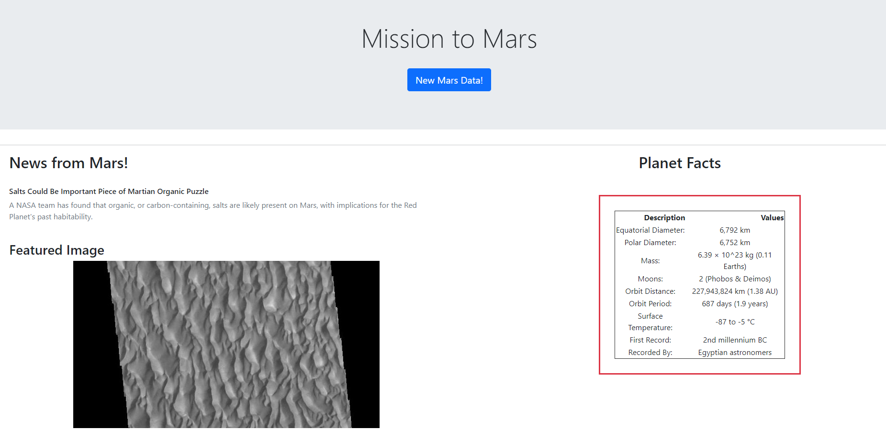
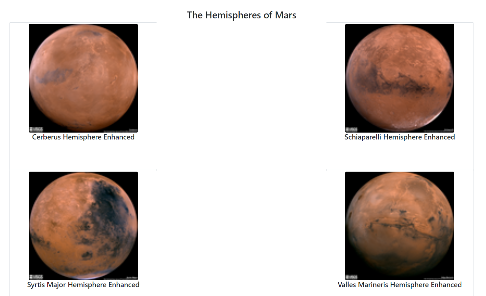

# Web Scraping Homework - Mission to Mars

In this assignment, I built a web application that scrapes various websites for data related to the Mission to Mars and displays the information in a single HTML page. The following outlines what I needed to do.

## Step 1 - Scraping

Complete my initial scraping using Jupyter Notebook, BeautifulSoup, Pandas, and Requests/Splinter.

* Created a Jupyter Notebook file called `mission_to_mars.ipynb` and use this to complete all of my scraping and analysis tasks. The following outlines what did to scrape.

### NASA Mars News

* Scraped the [NASA Mars News Site](https://mars.nasa.gov/news/) and collect the latest News Title and Paragraph Text. Assign the text to variables that I referenced later.

### JPL Mars Space Images - Featured Image

* JPL Featured Space Image [here](https://data-class-jpl-space.s3.amazonaws.com/JPL_Space/index.html).

* Use splinter to navigate the site and find the image url for the current Featured Mars Image and assign the url string to a variable called `featured_image_url`.

* Made sure to find the image url to the full size `.jpg` image.

* Made sure to save a complete url string for this image.

### Mars Facts

* Mars Facts webpage [here](https://space-facts.com/mars/) and used Pandas to scrape the table containing facts about the planet including Diameter, Mass, etc.

* Used Pandas to convert the data to a HTML table string.

### Mars Hemispheres

* USGS Astrogeology site [here](https://astrogeology.usgs.gov/search/results?q=hemisphere+enhanced&k1=target&v1=Mars) to obtain high resolution images for each of Mar's hemispheres.

* I needed click each of the links to the hemispheres in order to find the image url to the full resolution image.

* Saved both the image url string for the full resolution hemisphere image, and the Hemisphere title containing the hemisphere name. Used a Python dictionary to store the data using the keys `hemi_url` and `title`.

* Appended the dictionary with the image url string and the hemisphere title to a list. This list contained one dictionary for each hemisphere.

- - -

## Step 2 - MongoDB and Flask Application

Used MongoDB with Flask templating to create a new HTML page that displays all of the information that was scraped from the URLs above.

* Started by converting the Jupyter notebook into a Python script called `scrape_mars.py` with a function called `scrape` that will execute all of the scraping code from above and return one Python dictionary containing all of the scraped data.

* Next, created a route called `/scrape` that imported `scrape_mars.py` script and called `scrape` function.

  * Stored the return value in Mongo as a Python dictionary.

* Created a root route `/` that queried the Mongo database and pass the mars data into an HTML template to display the data.

* Created a template HTML file called `index.html` that took the mars data dictionary and displayed all of the data in the appropriate HTML elements. The following screenshots are what the index.html webpage displayed.

- - -

### Copyright

Trilogy Education Services © 2021. All Rights Reserved.
